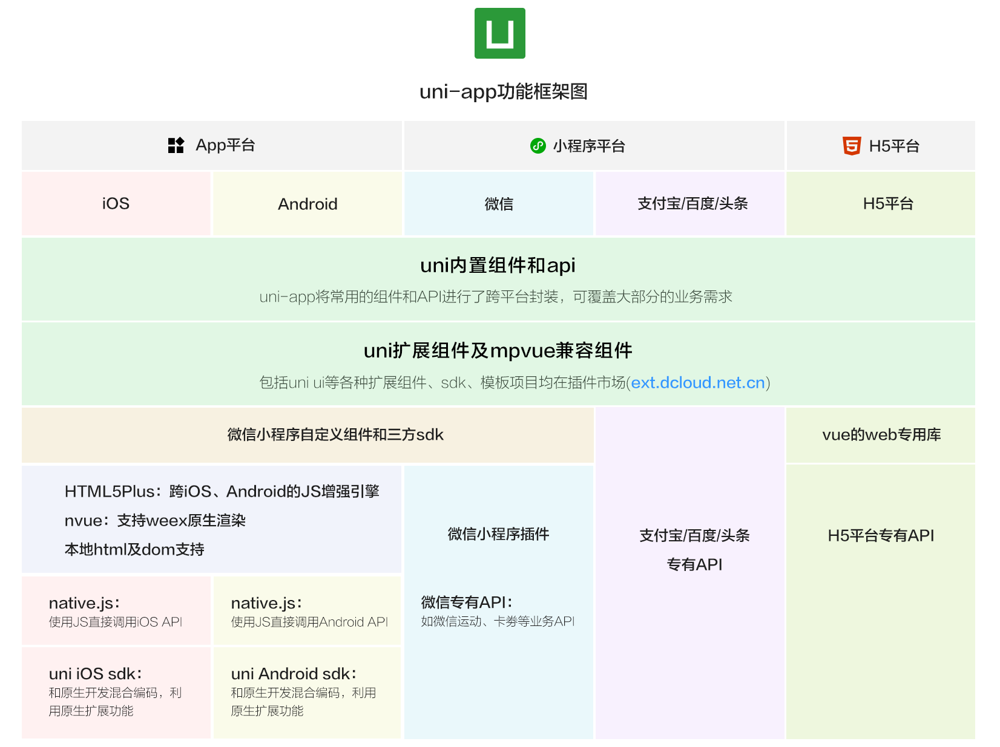

# uniapp-demo
## 开发工具
HBuilderX，简称HX，是轻如编辑器、强如IDE的合体版本。2018年10月，DCloud正式发布HBuilderX 1.0。虽然HBuilderX并不是100%覆盖老HBuilder的功能，从整体来看，HBuilderX已经是比HBuilder更好的开发工具。HX比HB有五大优势：更流畅、更高效、更现代、更漂亮、更稳定。HB本身主体是由Java编写，它基于Eclipse，所以顺其自然地兼容了Eclipse的插件。而HX基于C++架构而非eclipse或webkit架构，HX在启动速度、大文档打开速度方面远超HB，并在众多开发工具中傲视群雄。

## 开发框架
uni-app 是一个使用 Vue.js 开发跨平台应用的前端框架，开发者编写一套代码，可编译到iOS、Android、H5、小程序等多个平台。

注：DCloud.io，数字天堂（北京）网络技术有限公司。DCloud为开发者提供包括HBuilder、HTML5+、MUI、uni-app等开发工具，帮助开发者快速、低成本制作移动互联网多端应用。

## 目录结构

>components            uni-app组件目录
>
>>header.vue         可复用的header组件

>pages                       业务页面文件存放的目录
>
>>index.vue            index页面
>>
>>list.vue                 list页面

> hybrid                      存放本地网页的目录
>
> platforms                存放各平台专用页面的目录
>
> static                        存放应用引用静态资源（如图片、视频等）的地方，**注意：**静态资源只能存放于此
>
> main.js                     Vue初始化入口文件
>
> App.vue                   应用配置，用来配置App全局样式以及监听应用生命周期
>
> manifest.json         配置应用名称、appid、logo、版本等打包信息
>
> pages.json              配置页面路由、导航条、选项卡等页面类信息